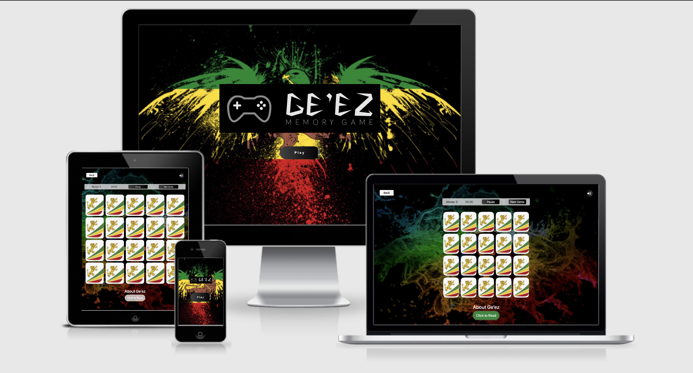
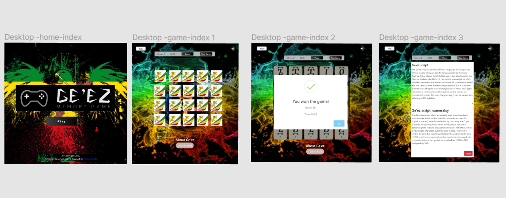
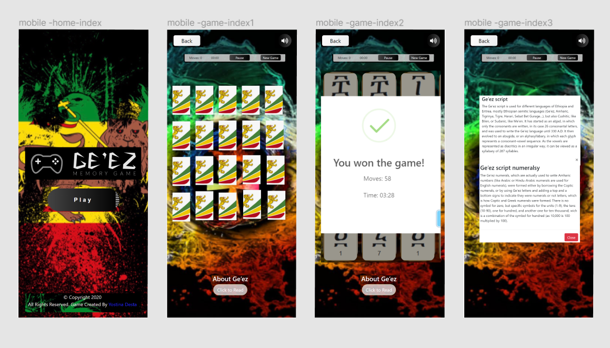
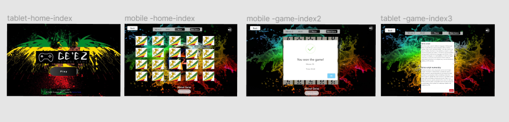

# Ge`ez Memory Game

## Code Institute: Milestone Project 2

*Geʽez (Geʽez: ግዕዝ, Gəʿəz)* s a script used as an abugida (alphasyllabary) for several languages of Eritrea and Ethiopia. It originated as an abjad (consonant-only alphabet) and was first used to write Geʽez, now the liturgical language of the 
the Ethiopian Orthodox Tewahedo Church,the Eritrean Orthodox Tewahedo Church,and Beta Israel, the Jewish community in Ethiopia. In Amharic and Tigrinya, the script is often called fidäl (ፊደል), meaning “script” or “letter.”
The Geʽez script has been adapted to write other languages, mostly Semitic, particularly Amharigna in Ethiopia, and Tigrinya in both Eritrea and Ethiopia. It is also used for Sebat Bet, Meʼen, and most other languages of Ethiopia. 
In Eritrea it is used for Tigre and it has traditionally been used for Bilen, a Cushitic language. Tigre, spoken in western and northern Eritrea, is considered to resemble Geʽez more than other derivative languages.
[citation needed] Other Cushitic peoples in the Horn of Africa, such as Oromos, Somalis and Afars, used Latin-based orthographies.

## A Look at Ethiopic Numerals
Ethiopic numerals have a familiar quality about them that seems to catch the eye and pique the imagination of the first-time viewer. In particular, the bars above and below the letter-like symbols appear reminiscent of their Roman counterparts.
The symbols in between the bars, however, are clearly not of Roman origin. The shapes appear Ethiopic but only half seem to correspond to Ethiopic syllables and in an incomprehensible order.

The mystery begins to unfold when we look at the lesser-known ancient Greek numeral system.The ancient Greeks used two numeral systems, in fact. The "Acrophonic" numeral system was used for weights and measures. 
The "Milesian" numeral system used universally and based on the lower case letters marked with a ' to indicate the numeric context. The Ethiopic numerals are said to have come from the interpretation of the Milesian system by Ethiopia's Nile brethren the Egyptian Copts.
In the Coptic practice the preferred numeric modifier was a bar, , placed above their lower case letters. Coptic script borrowed heavily from the Greek uppercase alphabet. 
The Coptic lowercase characters are nearly indistinguishable from the upper and the bar in some practices is also used as a means to clearly mark an uppercase context.
It is unclear if the Ethiopians borrowed the Coptic numerals outright or just the practice of using the alphabet to create a recordable counting system. Perhaps a little of both. 
It would be a difficult case to argue that ገ, ዐ, ጌ, ጊ, ሀ, ሣ, ሃ, ሮ, ን and የ. did not in some way influence the numerals ፫, ፬, ፮, ፯, ፱, ፵, ፶, ፸, ፺ and ፻.

My aim with this project was to create a game that allows the user to learn more about the oldest Ethiopian script and numbers interactively, keeping them interested, inspired, and motivated to continue learning more about Ethiopian history. 
Especially for the youngest generation, those who are living outside of Ethiopia.

I am always fascinated by the old history, especially when it comes to my country. 
The projects start with an idea to introduce to anybody who loves history and needs to emerge to chronicle, in a particular way for Ethiopians and Ertriens diasporas kids who love to play a simple game and at the same time to learn some Geez numbers.
I believe that some kids can learn any information any time they want. But it seems to me that most kids learn a lot more when they are interested in the topic.  As I had just completed an introductory module on JavaScript, 
I decided to implement JavaScript throughout my project and, at the same time, to teach children a little an impressive Geez numbers.

This was the second of four Milestone Projects that made up the Full Stack Web Development Program at *The Code Institute*. 
The main requirements were to make an interactive and responsive website with HTML5, CSS3 and JavaScript.

[Click here to view the project live.](https://yostina-dh.github.io/Ge-ez-Memory-Game/)

## UX

### Main aims

- To make the game more interactive through the use of JavaScript, with different features such as moving cards, start the game, pause the game, count the timer ETC...

- To make learning about the Geez numbers seem exciting still nowadays to users, by creating a game that anyone can play and learn a new thing.

- To make it easy for users to make their way through each feature on the game, by having a single click play button and including different kinds of future throughout with a consistent design.

- To create a design that would be fully responsive on all devices and screen sizes. 

### User Stories

The following User Stories helped me to create a design that would satisfy the needs of several different types of users.

#### Project stakeholders

- I am one of the creators of this game and want to see it succeed. I want to attract many users who want to learn new things and get excited to play a game. And to show and teach the rest of the world about the history of my motherland.

#### New users

- I am a user who has never really considered that the ancient Geez number still exists. I want to use this game to learn more about the Geez script and see how much I've now learned by taking this simple game.
- I am a user who wants to learn a new thing and especially world history, preferably using a straightforward method to memorize what I have learned so far.

#### Returning users

- I am an habesha diaspora kid who wants to discuss the Geez script with my parents. I often rely on interactive sources online to do so and have returned to this matching game website again, as I find it useful to introduce the game for my parents and show them what they've learned using the simple game method.
- I have used this game site to learn about Geez numbers in the past and now want to remind myself how many of them I remember.

#### Youngster user

- I am a young generation user who loves to play a matching game using browse websites instead of Apps. I want to have a good experience on this website and view all the features in an equally aesthetic way.

### Design Process

1. Strategy plane: From the onset, I knew that my primary aim was to introduce and educate users about Geez script and numbers in a way that was fun, engaging, and memorable. However, as I had just begun to develop my JavaScript skills, my aim for this particular project was also to design a project where I could combine these two. I, therefore, started the UX process by creating the list of User Stories above, as they helped me crystalize who this project was aimed for and what would be necessary to satisfy them successfully.

2. Scope plane: After deciding on the primary purpose of the project, I started describing the essential features that I wanted my game to have. To do that, I focused on JavaScript that I wanted to experiment with and ultimately implement because I knew this would be crucial to making the game interactive. This made me decide that I wanted to focus on three essential features: a page with how to shuffle the game randomly, how to pause the game, how to start the new game, and the chance to make some noise if needed and play Mutley.

3. Strcuture plane:Once I had limited which functions I wanted to include, I began to formulate the structure of my design in two separate pages: 'Home' and 'Game page.' These seemed logical to me since "Home" would welcome and introduce the game name to users. They would then proceed to "A game page" to play and learn about Geez script and numbers: they can start playing a game that uses one click on the cards. It seems logical to click. In addition to using a pause button to pause the timer counter and start the game whenever the user needs, I also decided that I wanted to include the back button to encourage the user to go to the home page and see the powerful abstract image website.

4. Skeleton plane: As mentioned in the Structure Plane, I had begun to consider including two main ways for the user to simplify the game: both the home section and game section and add different kinds of future of buttons as prompts. I came to this decision while considering the pace that I wanted the user can play a flexible way and learn something new at the same time. Mostly rely on the matching game to have a soundtrack when a user success or fail so that it would give me more interesting for a partially-Sighted or legally Blind user. They can play just following the soundtrack of the game and creating fun of it and a positive user experience. 

5. Surface plane: 
    * For my design to work, I knew it would be essential to create a theme that would keep the user interested.Thinking about the Geez memory game can feel overwhelming because it's such a fascinating history to learn.
    * With this in mind, I started a workspace on [Figma](https://www.figma.com/file/4qeFVv4TZCsubETcYYdIsU/Geez-Memory-Game-(Copy)?node-id=10%3A2).
       - The card background images represent the royal flag often featured the emblem of a Lion of Judah, a crowned lion carrying a cross centred in the banner's yellow midsection.
         The flag is understood to be a link between the Ethiopian Orthodox Tewahedo Church, the peoples, and the nation that was united.
##### Flag Meaning
- The green band represents Ethiopia’s fertile land and natural wealth; 
- The yellow, hope, peace and harmony of its people;
- The red, its bravery and sacrifice paid to defend and preserve the country’s sovereignty.
    * I turned to Google Fonts to select the fonts for my project. I wanted to find two compatible fonts that would help to both make the design look credible (so users would take it seriously as a source of information), but that would not be intimidating as I want the users to feel motivated to read on.
    
> Note: Throughout the design process, I kept referring back to my original 'Main Aims' and 'User Stories' to make sure that my project was developing as intended.

### Wireframing my project on Figma

Design for desktop devices:

Design for mobile devices:

Design for tablet devices:

## Features

### Existing Features

This project consists of two pages, one of which can be accessed with a single play button. And a back button if users need to back up the home page.

#### Consistent features across all pages

- The play button in the center of the homepage and footer is consistent and responsive throughout the site.
- A back button to return the home page
- Count your moves
- Live Stopwatch
- Rating System [ Based on your **Moves!** ]
- Retry/Restart the game button
- A silent button

#### How The Game Works

The game board consists of Twenty "cards" arranged in a flex. The deck comprises ten different pairs of cards, each with other Geez numbers symbols on one side. The cards are placed randomly on the grid with the symbol face down. The gameplay rules are very
simple: open two hidden cards at a time to locate the ones that match!

Each turn:

- The game randomly shuffles the cards.
- The player opens one card over to reveal its underlying Geez number.
- The player then opens a second card, trying to find the corresponding card with the same Geez number and that will be counted as one move.
- If the cards match, both cards stay opened.
- If the cards do not match, both cards are closed again.
- When a player wins the game, a modal pop up a Won and and show the Moves.

#### What Will I Learn?

The memory game presents the first opportunity to fully combine HTML, CSS, and JavaScript into a large project. 
Aside from solidifying your skills with these three technologies, you'll learn how best to combine them in a complex application.
What's the ideal workflow? How many files do you need? Do you write the HTML first? The JavaScript?

#### Hints

- I recommend starting off working on a very simple grid of cards. Don't worry about styling, just get something clickable on the page
- Figure out how each card is structured. Remember, you have to represent two sides of the card. Are you going to have two separate elements stacked on top of each other?
- Once you have a grid, add in the click logic to reveal the hidden side of each card
- Next, work on the matching logic. How does your game "know" if a player guesses correctly or incorrectly?
- I recommend saving styling until the very end. Allow your game logic and functionality to dictate the styling.

## Technologies Used

### Languages, libraries, frameworks, editors and version control

- HTML5
    * The language used to create the form and add content to the website.
- CSS3 
    * The language used to style the HTML5 elements according to the design colour scheme.
- JavaScript
    * The language used to create shuffle the cards randomly, implement Count your moves the feature, Live Stopwatch, Rating System, retry/Restart the game button, and a mute button throughout the project.
- [jQuery](https://jquery.com/)
    * I used the jQuery library to help write the code for the cards
- [Bootstrap framework](https://getbootstrap.com/) 
    * I decided to use the Bootstrap 4  Modal system as I wanted to design the script about Geez
- [Gitpod](https://www.gitpod.io/)
    * I relied on Gitpod's dev environment to write the code for my project.
- [Git Version Control](https://git-scm.com/)
    * I used Git for Version Control to track and record changes to my code and refer back when needed.
- [GitHub](https://github.com/)
    * I hosted my deployed website to GitHub, with previous versions of my code stored through the commit history.

## Additional tools used

- [Figma](https://www.figma.com/) 
    * Figma helped me design my project, by creating wireframes for desktop, tablet and mobile devices. 
- [depositphotos](https://depositphotos.com/) 
    * This was the source of several of the images used in my project, fully referenced in the 'Media' section below.
- [TinyPNG](https://tinypng.com/) 
    * I used TinyPNG to compress my image files to try to reduce the loading time for each page. 
- [Google Fonts](https://fonts.google.com/)
    * I used two complementary fonts from Google for my project: sans-serif,BlinkMacSystemFont,"Segoe UI",Roboto,"Helvetica Neue",Arial,"Noto Sans",sans-serif,"Apple Color Emoji","Segoe UI Emoji","Segoe UI Symbol","Noto Color Emoji";
- [W3C Markup Validation Service](https://validator.w3.org/) 
    * This was a great tool throughout the project to check whether there were any errors in my HTML and CSS code.
 - [Codebeautify](https://codebeautify.org/jsvalidate) 
    * This tool helped me test my JavaScript and jQuery code (explained in more detail in the Testing section below). 

## Testing

Please view the complete testing process in this separate document [here](https://github.com/YOSTINA-dh/Ge-ez-Memory-Game/blob/master/testing.md).

## Deployment

### Deploying my project 

I created my project on GitHub and used GitPod's development environment to write my code. 
Use the following link to view my live project: [Ge-ez-Memory-Game](https://yostina-dh.github.io/Ge-ez-Memory-Game/)

#### Deploying to GitHub Pages
To make my project viewable to others, I deployed my project to GitHub Pages with the following process:

1. I opened the 'Settings' section of my project repository in GitHub.
2. From there, I scrolled to the 'GitHub Pages' section.
3. Here I selected 'master branch' as my Source.
3. This deployed my project on GitHub Pages and allowed me to share the live website with others. 

More information about this process can be found on the following link: [Configuring a publishing source for your GitHub Pages site](https://help.github.com/en/github/working-with-github-pages/configuring-a-publishing-source-for-your-github-pages-site)

### Cloning my project

If you would like to work on my project further you can clone it to your local machine using the following steps:

1. Scroll to the top of my repository and click on the "clone or download button"
2. Decide whether you want to clone the project using HTTPS or an SSH key and do the following:
    * HTTPS: click on the checklist icon to the right of the URL
    * SSH key: first click on 'Use SSH' then click on the same icon as above
3. Open the 'Terminal'
4. Change the current working directory to the location where you want the cloned directory
5. Type 'git clone', and then paste the URL you copied earlier.
6. Press 'Enter' to create your local clone.
    
You can find both the source of this information and learn more about the process on the following link: [Cloning a Repository](https://help.github.com/en/github/creating-cloning-and-archiving-repositories/cloning-a-repository)

## Credits

### Content

The content of this website is entirely fictional and written by myself.

### Images

The images are from Pexels, The National Geographic and The Ocean Cleanup and are referenced below. 

#### Depositphotos

- [Image of the home page](https://depositphotos.com/stock-photos/abstract-ethiopian-flag.html)
- [Image of the game page](https://depositphotos.com/stock-photos/abstract-ethiopian-flag.html)
- [Image of the cards](http://allhabesha.com/sr-sales-service-officer-job-at-ethiopian-airlines/)
- [Image of the geez number](https://www.languagesandnumbers.com/how-to-count-in-amharic/en/amh/)

### Acknowledgements

#### Examples and Tutorials and Samples

* [The freecodecamp/](https://www.freecodecamp.org/) used for the project and understand the syntacs for my code.
* [Youtuber](https://www.whatsdev.com/) used to for inspiration and ideas for the wbiste structure. 
* [Youtuber](http://www.cleverprogrammer.com/)used to for inspiration and ideas for the game structure.
* [Mozilla.org](https://developer.mozilla.org/en-US/)used for the project and understand the syntacs for my code.

 ##### Inspiration resources for writing this README file:
* [Miranda](https://github.com/mkthewlis/Milestone-Project-3) (A code institute student)
    
#### Pages used for information

* [The freecodecamp/](https://www.freecodecamp.org/)
* [YouTuber](https://www.whatsdev.com/)
* [YouTuber](http://www.cleverprogrammer.com/)
* [W3schools](https://www.w3schools.com/)
* [W3C](https://www.w3.org/)
* [Stack overflow](https://stackoverflow.com/)
* [CSS-Tricks](https://css-tricks.com/)
* [Mozilla.org](https://developer.mozilla.org/en-US/)

 ##### Thank you to the following people who helped with support, inspiration and guidance at different stages in the project:
- The guidance and support of my mentor Seun Owonikoko
- The supportive *freecodecamp* community
- The supportive *Code Institute* community, including my fellow students and the tutor support team
- My family and friends, for their support and patience, especially (JUAN DAVID), without you, I couldn't be able to finish this project.

# Licensing 
This project is licensed under the [MIT License](https://github.com/JS-goose/udacity-project-2/blob/master/LICENSE) and you are **free** to do the following with the code, subject to the conditions provided within the license found at the link above:
* use
* Copy
* Modify
* Merge
* Publish
* Distribute
* Sublicense
* Sell

#### Disclaimer
**This game was created for educational purpose only.** 